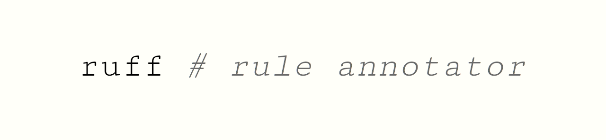

# ruffruleannotator

ruffruleannotator is a small tool designed to enhance the readability of Ruff configuration files by annotating all rule IDs with their corresponding titles. This allows users to easily understand the purpose of each ignored/selected rule within their codebase. Additionally, ruffruleannotator can sort the rule IDs within the relevant sections of the TOML file, ensuring a well-organized and readable configuration.

## Example 
Consider the following `pyproject.toml`:
```toml
[project]
name = "packagename"

[tool.ruff.lint]
select = ["D100", "D103", "ERA001", "PLR2004", "F"]

ignore = ["E501", "B"]

[tool.ruff.format]
quote-style = "single"
```
Executing `ruffruleannotator` yield a reformatted config with annotated rule IDs:
```toml
[project]
name = "packagename"

[tool.ruff.lint]
select = [
    "D100",      # undocumented-public-module (pydocstyle)
    "D103",      # undocumented-public-function (pydocstyle)
    "ERA001",    # commented-out-code (eradicate)
    "F",         # Pyflakes
    "PLR2004",   # magic-value-comparison (Pylint (Refactor))
]

ignore = [
    "B",         # flake8-bugbear
    "E501",      # line-too-long (pycodestyle errors)
]

[tool.ruff.format]
quote-style = "single"
```

## Installation
```shell
pip install ruffruleannotator
```

## Usage
The tool automatically recognizes ruff configs inside `pyproject.toml` and `ruff.toml`. The entries `select`, `ignore`, `fixable` and `unfixable` inside the Ruff lint section of the config are supported for reformatting. All other parts of the file stay unchanged.

Execute the tool inside project root directory:
```shell
ruffruleannotator
```

### Keep order of entries
By default `ruffruleannotator` sorts the rule IDs within the sections alphabetically. The order of entries can be preserved: 
```shell
ruffruleannotator --no-sort
```

### Check
`ruffruleannotator` can be easily integrated in a CI/CD pipeline by checking if changes
would be applied or not. Running
```shell
ruffruleannotator --check
```
will return with exit code 0 or 1 respectively without applying any changes.


### Interactive mode
By default `ruffruleannotator` shows changes and waits for user confirmation before actually changing the config:
```diff
Found ruff config in 'pyproject.toml'

--- 
+++ 
@@ -2,9 +2,18 @@
 name = "packagename"
 
 [tool.ruff.lint]
-select = ["D100", "D103", "ERA001", "PLR2004", "F"]
+select = [
+    "D100",      # undocumented-public-module (pydocstyle)
+    "D103",      # undocumented-public-function (pydocstyle)
+    "ERA001",    # commented-out-code (eradicate)
+    "F",         # Pyflakes
+    "PLR2004",   # magic-value-comparison (Pylint [Refactor])
+]
 
-ignore = ["E501", "B"]
+ignore = [
+    "B",         # flake8-bugbear
+    "E501",      # line-too-long (pycodestyle errors)
+]
 
 [tool.ruff.format]
 quote-style = "single"

Press enter to apply changes
```

Changes can be applied without user confirmation by calling
```shell
ruffruleannotator --yes
```

### Complex formattings
Consider the following config file:
```toml
[tool.ruff.lint]
select = ["F404",
    "F403",
    # Comment lines break the sorting. Rule IDs are sorted
    # seperately above and below the comment line.
    "F406", # already commented lines are not annotated
    "F402",
    # Lines with multiple rule ids are split
    "E112", "E111",
    "E113"]
```
After reformatting:
```toml
[tool.ruff.lint]
select = [
    "F403",      # undefined-local-with-import-star (Pyflakes)
    "F404",      # late-future-import (Pyflakes)
    # Comment lines break the sorting. Rule IDs are sorted
    # seperately above and below the comment line.
    "F402",      # import-shadowed-by-loop-var (Pyflakes)
    "F406", # already commented lines are not annotated
    # Lines with multiple rule ids are split
    "E111",      # indentation-with-invalid-multiple (pycodestyle errors)
    "E112",      # no-indented-block (pycodestyle errors)
    "E113",      # unexpected-indentation (pycodestyle errors)
]
```

## Contributing

- Create virtual environment
    ```shell
    python3 -m venv venv
    source venv/bin/activate
    pip install -r requirements-dev.txt
    ```
- Setup pre-commit
    ```shell
    pre-commit install
    ```
- Build package
    ```
    python -m build
    ```
